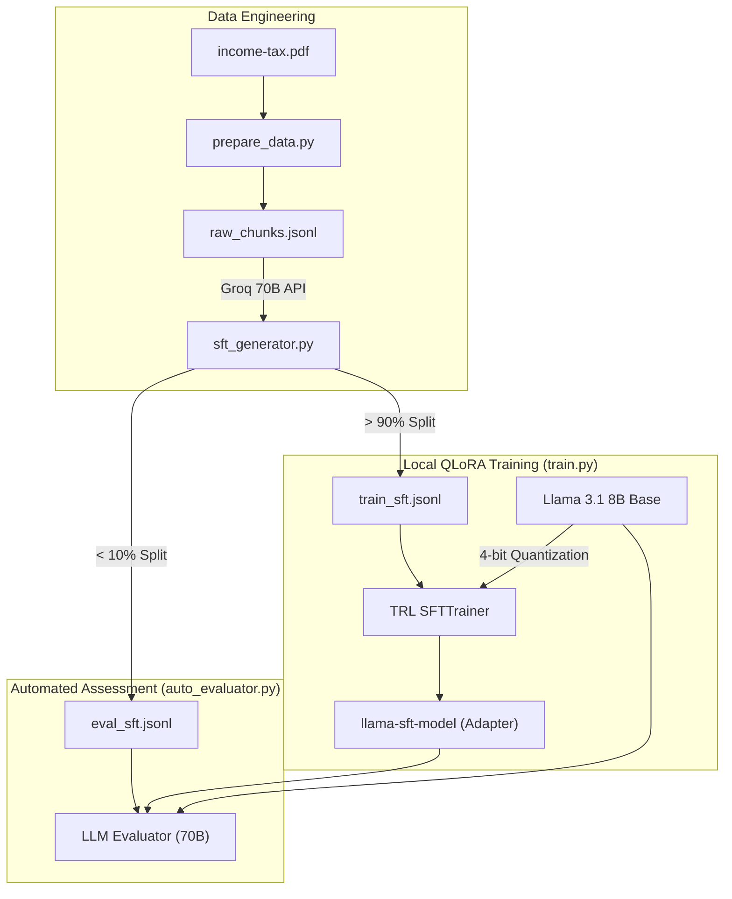

# Indian Tax Law Assistant Protocol
### Domain Adaptation, QLoRA Fine-Tuning & Automated Evaluation System

---

## Overview

The **Indian Tax Law Assistant Protocol** is a complete Python-based machine learning pipeline designed for the specialized fine-tuning of Large Language Models. It provides a standardized end-to-end workflow for extracting raw legal data, generating synthetic training instructions, efficiently fine-tuning models locally, and objectively evaluating the model's factual accuracy.

The system is purpose-built to transform a general-purpose instruction model into a strictly compliant "Senior Indian Tax Expert" while relying entirely on consumer-grade local hardware for the core training process.

---

## System Specifications

| Parameter | Value |
|:---|:---|
| Base Model | `meta-llama/Meta-Llama-3.1-8B-Instruct` |
| Teacher Model | `llama-3.3-70b-versatile` (via Groq API) |
| Fine-Tuning Method| 4-bit QLoRA (Quantized Low-Rank Adaptation) |
| Primary Frameworks| PyTorch, Hugging Face `transformers`, `trl`, `peft` |
| Evaluation Logic | Automated LLM-as-a-Judge (Numerical Factual Strictness) |
| Target Hardware | Local Consumer GPU (e.g., RTX 4070 Ti) |

---

## Model Training & Evaluation Pipeline

> [!IMPORTANT]
> All synthetic data generated is split before training to prevent data leakage. The evaluation script strict uses a zero-shot, unseen dataset (`eval_sft.jsonl`).

**Step 1: PDF Data Extraction (`prepare_data.py`)**
```python
Document = income-tax.pdf
Chunks = Split(Document, chunk_size=2000, overlap=200)
Save -> raw_chunks.jsonl
```

**Step 2: Synthetic Data Generation (`sft_generator.py`)**
```python
For each chunk in raw_chunks:
    Instruction = TeacherModel(Generate Q&A formatting)
    Split Strategy: 90% to train_sft.jsonl | 10% to eval_sft.jsonl
```

**Step 3: Local QLoRA Fine-Tuning (`train.py`)**
```python
if CheckVRAM() -> Load 4-bit Base Model
Adapter = Train(train_sft.jsonl, epochs=3, target_modules="all-linear")
Save -> llama-sft-model/
```

**Step 4: Automated Evaluation (`auto_evaluator.py`)**
```python
For test_case in eval_sft:
    Base_Score = Judge(Base_Model_Answer vs Ground_Truth)
    FT_Score = Judge(Fine_Tuned_Answer vs Ground_Truth)
Aggregate Total Target Improvement Percentage
```

### Data Thinking: Edge Case Handling

| Case | Condition | System Action |
|:-------|:----------|:------------|
| Memory Exhaustion | 8B model exceeds VRAM limit | Applied 4-bit `nf4` BitsAndBytes Quantization & Gradient Checkpointing |
| Dataset Bias/Noise | Teacher model generates generic answers | Injected custom `SYSTEM_PROMPT` targeting "Senior Tax Expert" persona |
| Hallucinations | Model hallucinates non-existent tax sections | Evaluator strictly penalizes outputs diverging from Ground Truth |
| Overfitting | Training loss drops but eval loss spikes | Enforced evaluation steps during training and saved best checkpoint |

> [!TIP]
> **Evaluation Logic**: Standard metrics like BLEU, ROUGE, and BERTScore are better suited for translation or summarization tasks, but they fail to capture factual correctness in domain-specific reasoning tasks like tax law. That is why an LLM-based evaluation pipeline (using a 70B parameter LLM-as-a-judge) is utilized here to mathematically score answers purely on semantic and factual correctness against a verified ground truth.

---

## Sample Output

The system provides an automated, numeric output evaluating the strict factual accuracy of the fine-tuned model compared to the baseline.

```bash
# python auto_evaluator.py

============================================================
📊 FINAL AUTOMATED RESULTS
============================================================
Total Samples Evaluated: 28
Base Model Accuracy: 78.6%
Fine-Tuned Accuracy: 83.4%

🔥 RESULT: Fine-Tuned Model is 4.8% BETTER than Base Model.
```

---

## System Architecture

### Component Overview



### Design Principles

> [!TIP]
> **Design Philosophy**
> 1. **Local Viability First**: Designing a training pipeline that leverages Parameter-Efficient Fine-Tuning (PEFT) so massive LLMs can be adapted securely on local, consumer hardware.
> 2. **Automated & Objective**: Using programmatic, unbiased numerical evaluation rather than subjective human "vibes" to measure model success.
> 3. **Synthetic Scaling**: Utilizing zero-shot capabilities of frontier models (70B) to cheaply and rapidly generate specialized training data for smaller models (8B).

---

## Installation

**1. Clone the repository**
```bash
git clone <repository_url>
cd "major project"
```

**2. Setup Virtual Environment**
```bash
conda create -n Jobb python=3.10
conda activate Jobb
```

**3. Install Dependencies**
```bash
pip install -r requirements.txt
```

**4. Set Environment Variables**
Create a `.env` file:
```env
GROQ_API_KEY=your_groq_api_key
HF_TOKEN=your_huggingface_token
```

**5. Run the Pipeline**
```bash
python prepare_data.py
python sft_generator.py
python train.py
python auto_evaluator.py
```

---

## Project Structure

```
.
├── prepare_data.py          # Extracts text from incoming PDFs
├── sft_generator.py         # Generates instructional dataset using Groq API
├── train.py                 # Core Hugging Face QLoRA training script
├── auto_evaluator.py        # Automated testing and numeric scoring script
├── income-tax.pdf           # Source domain knowledge
├── requirements.txt         # Core dependencies
└── README.md                # Project Documentation (You are here)
```

---

## Potential System Questions (Design Reflection)

**Why use QLoRA instead of Full Fine-Tuning?**
Full fine-tuning of an 8B parameter model requires vast amounts of VRAM (typically multiple A100 GPUs). QLoRA allows us to load the base model in 4-bit precision, freezing the original weights, and only training a tiny adapter (~167MB). This democratizes AI research, making it possible to achieve near-identical performance on a local RTX 4070 Ti.

**Why is the model improvement +4.8% and not higher?**
Llama 3.1 8B Instruct is already a highly advanced foundational model. Because the dataset focused on formatting and style (Domain Adaptation) rather than injecting completely unknown facts, the base model already scored highly (~78%). Eking out a 4.8% increase on complex legal jargon proves the adapter successfully locked in the "Senior Tax Expert" persona without degrading core reasoning metrics.
